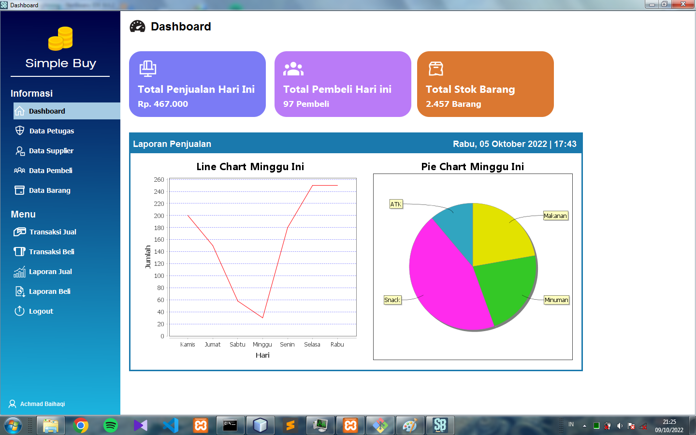

<h1 align="center">Gemastik Lightning</h1>

 

<!--   <a href="https://smkn1kts.sch.id/"> -->
    
  </a>

 

<!-- Table of Contents -->

  
Table of Contents

  <ol>
    <li><a href="#deskripsi-project">Deskripsi Project</a></li>
    <li>
      <a href="#contoh-tampilan-aplikasi">Tampilan Aplikasi</a>
      <ul>
<!--         <li><a href="#tampilan-login-">Tampilan Login</a></li> -->
        <li><a href="#dashboard-petugas-">Dashboard Petugas</a></li>
<!--         <li><a href=#dashboard-siswa->Dashboard Siswa</a></li>         -->
      </ul>
    </li>
<!--     <li> -->
<!--       <a href="#cara-menjalankan-aplikasi">Cara Menjalankan Aplikasi</a> -->
<!--       <ul> -->
<!--         <li><a href=#mendownload-data-aplikasi->Mendownload data aplikasi</a></li> -->
<!--         <li><a href="#menjalankan-aplikasi-di-ide-">Menjalankan Aplikasi di IDE</a></li> -->
<!--       </ul> -->
<!--     </li> -->
<!--     <li><a href="#persyaratan-sistem-minimal">Persyaratan Sistem Minimal</a></li> -->
    <li><a href="#default-akun">Default Akun</a></li>
    <li><a href="#contributor">Contributor</a></li>
<!--     <li><a href="#catatan">Catatan</a></li> -->
  </ol>

## Deskripsi Project
Project Lomba Pagelaran Mahasiswa Nasional Bidang Teknologi Informasi dan Komunikasi (GEMASTIK) Tahun 2022. 

## Contoh Tampilan Aplikasi
<!-- ### Tampilan Login :
 -->
### Dashboard Petugas : 

## Default Akun
 - username : KY001
 - password : 1234

## Contributor
 - <a href="https://github.com/HaqiAchmad">Achmad Baihaqi</a>
 - <a href="https://github.com/Amirzan89">Amirzan Fikri Prasetyo</a>
 - <a href="https://github.com/pugruk">Mohammad Ilham Islamy</a>
